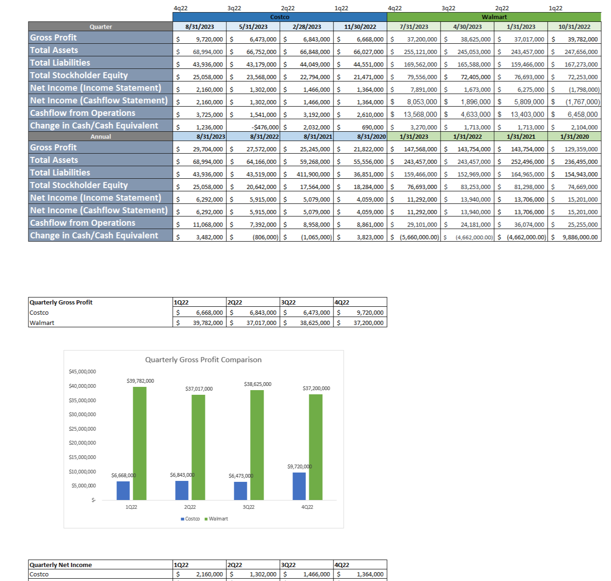

# Costco vs Walmart Financial Analysis

## Project Summary
This project compares the financial performance of **Costco and Walmart** using Microsoft Excel. The goal was to organize and analyze financial data to better understand how the two companies differ in terms of profitability and financial structure.

Instead of focusing on a single metric, the spreadsheet compares multiple financial indicators side by side to highlight differences in performance.

## Key Question
Which company appears to have stronger financial performance based on the available financial data?

## Metrics Analyzed
The analysis includes comparisons of several financial metrics:

- Gross profit  
- Net income  
- Total assets  
- Total liabilities  
- Shareholder equity  
- Cash flow from operations  
- Changes in cash and cash equivalents  

These metrics are compared across multiple quarters and annual reporting periods.

## Tools Used
- Microsoft Excel  
- Spreadsheet formulas  
- Financial data comparison  
- Data visualization with charts  

## Example Analysis
Below is a section of the workbook showing a comparison of quarterly financial performance between the two companies.

## Repository Contents
- costco_walmart_financial_analysis.xlsx
- analysis.png
- README.md

## Takeaway
This project demonstrates how spreadsheet tools can be used to organize financial statements and compare companies operating within the same industry. By structuring financial data clearly, it becomes easier to identify trends and differences in company performance.
